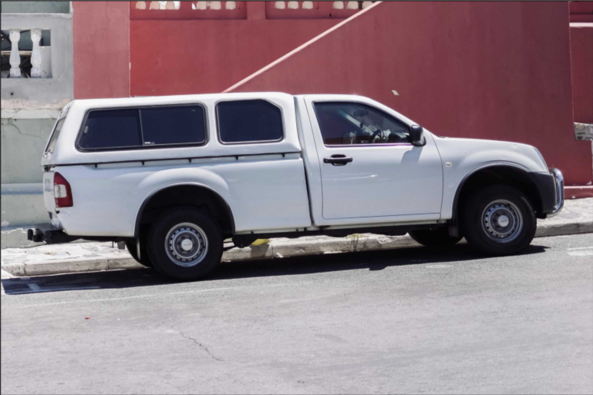
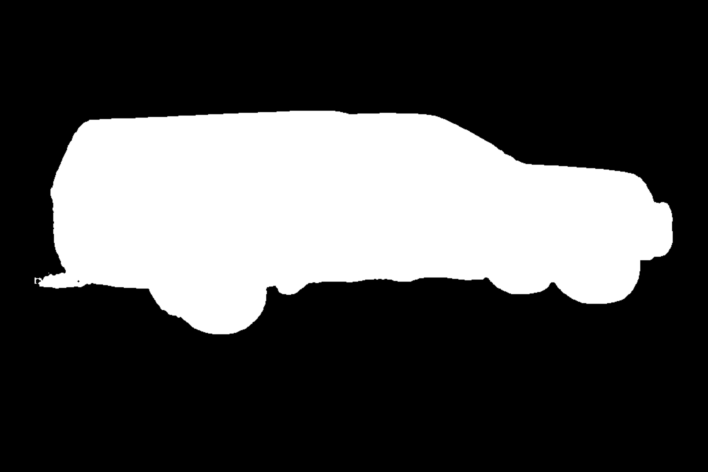

# Grounded Segmentation Project

This project provides a simplified and streamlined implementation of Grounding DINO and Segment Anything Model (SAM) for advanced image segmentation tasks. Unlike many existing solutions that require complex setup processes, multiple repository downloads, and separate model file management, this project offers a lightweight and easy-to-integrate solution. It's designed to be straightforward to use and incorporate into larger projects without the overhead typically associated with combining these powerful models.

The implementation is inspired by [Niels Rogge's Transformers-Tutorials](https://github.com/NielsRogge/Transformers-Tutorials/blob/master/Grounding%20DINO/GroundingDINO_with_Segment_Anything.ipynb), but focuses on simplicity and ease of use, making it accessible for developers who need efficient image segmentation capabilities without the complexity of managing multiple dependencies and large model files.

## Example

| Input Image | Output Mask | Prompt |
|-------------|-------------|--------|
|  |  | "car" |

## Table of Contents
- [Introduction](#introduction)
- [Features](#features)
- [Installation](#installation)
- [Usage](#usage)
- [Models](#models)

## Introduction

This project utilizes Grounding DINO for object detection and Segment Anything Model (SAM) for precise image segmentation. It provides a powerful tool for various computer vision tasks, combining the strengths of both models.

## Features

- Zero-shot object detection using Grounding DINO
- High-quality image segmentation with SAM
- Flexible model selection for different performance needs
- Easy-to-use interface for processing images

## Installation

To set up this project, follow these steps:

1. Clone the repository:
   ```
   git clone https://github.com/okaris/grounded-segmentation.git
   cd grounded-segmentation
   ```

2. Create a virtual environment (optional but recommended):
   ```
   python -m venv venv
   source venv/bin/activate  # On Windows, use `venv\Scripts\activate`
   ```

3. Install the required dependencies:
   ```
   pip install -r requirements.txt
   ```

   Note: Make sure you have the correct CUDA version for PyTorch. The current `requirements.txt` uses CUDA 12.4. If you need a different version, please edit the `requirements.txt` file accordingly.

## Usage

Here's a basic example of how to use the grounded segmentation:

```
python segment.py --image_url "https://github.com/okaris/grounded-segmentation/blob/main/assets/car.png" --keyword "car" --output "mask.png"
```

This will download the image, detect the object, and segment it. The mask will be saved as `mask.png`.

You can also specify the model to use (see models section below for available models):

```
python segment.py --image_url "https://github.com/okaris/grounded-segmentation/blob/main/assets/car.png" --keyword "car" --dino_model "IDEA-Research/grounding-dino-tiny" --sam_model "facebook/sam-vit-huge" --output "mask.png"
```

Using as a class:

```
from PIL import Image
from segment import ObjectSegmenter

# Initialize the segmenter with default models. This will download the models to the local cache and as long as the initialised object is kept, the models will not be downloaded or loaded again.

segmenter = ObjectSegmenter()

image = Image.open("assets/car.png")
mask = segmenter.segment(image, "car")
mask.save("mask.png")
```

## Models

The models used in this project are:

### SAM (Segment Anything Model)
- [facebook/sam-vit-huge](https://huggingface.co/facebook/sam-vit-huge): Default. Highest quality, but slower and more resource-intensive
- [facebook/sam-vit-large](https://huggingface.co/facebook/sam-vit-large): Good balance of quality and speed
- [facebook/sam-vit-base](https://huggingface.co/facebook/sam-vit-base): Fastest, but lower quality

### Grounding DINO
- [IDEA-Research/grounding-dino-base](https://huggingface.co/IDEA-Research/grounding-dino-base): Higher quality, but slower
- [IDEA-Research/grounding-dino-tiny](https://huggingface.co/IDEA-Research/grounding-dino-tiny): Default. Faster, but lower quality

Choose the appropriate model based on your requirements for speed and accuracy.
